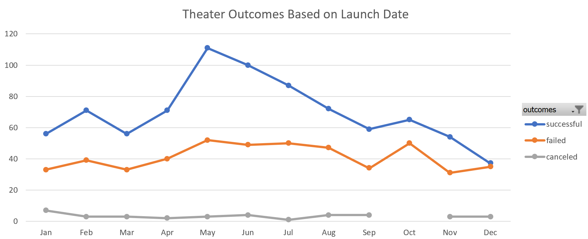
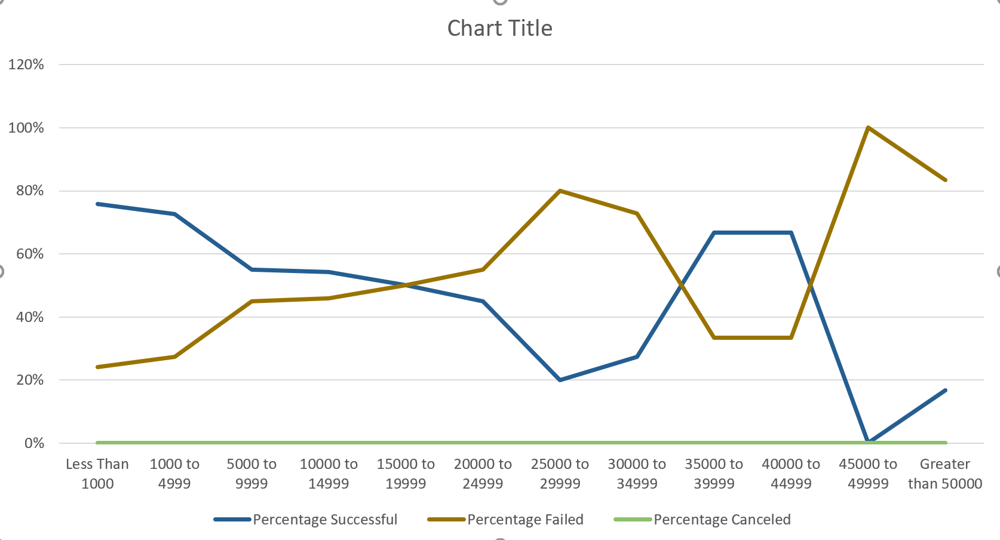

# Kickstarting with Excel

## Overview of Project
This project involves performing technical analysis of data to determine outcomes based on Launch Dates and Goals using the capabilities of Excel, specifically using Pivot Tables and Graphing capabilities, in addition to using various built-in macros which allow us to perform statistical analysis.

### Purpose
Louise’s play Fever came close to its fundraising goal in a short amount of time. Following on to this, we now want to understand how campaigns fared in relation to their launch dates and their funding goals. 

## Analysis and Challenges
Analysis was performed using the Launch Date and Goals.

### Analysis of Outcomes Based on Launch Date
May, June and July were the months with the highest number of successful theater outcomes, with May being the month with highest number of successful outcomes, as well as total number of launches.

### Analysis of Outcomes Based on Goals
Smaller goals tended to have higher degree of success, although there was a small band of higher goal campaigns that also succeeded.

### Challenges and Difficulties Encountered
To get a fuller understanding and perform a more detailed analysis, a better understanding of the concepts of variance and identification of outliers is required.

## Results

### What are two conclusions you can draw about the Theater Outcomes based on Launch Date?

1) The month that had the highest number of successful theater outcomes was May.
2) February, April and August had the roughly the same number of successful outcomes.
3) January, March, September, November and December had similar numbers of failed outcomes.

### What can you conclude about the Outcomes based on Goals?

Campaigns with smaller goal amounts tended to have a significantly higher chance of being successful, specifically campaigns with goals less than $5,000 had a roughly 75% chance of succeeding, with the success rate dropping progressively as the goal amounts increased. Once the goal amounts exceeded the $20,000 mark, the success rate dropped to less than 50%. Interestingly, the campaigns between $35,000 to $45,000 bucked this trend of low success rate in the higher ranges; with these campaigns having a 2 in 3 chance of success (67%). Again, at the higher end of the spectrum the chances of success dropped significantly - for amounts over $45,000.

### What are some limitations of this dataset?
There is not enough data for campaigns with higher goal amounts. It would be harder to predict with confidence the rate of success for those campaigns.

### What are some other possible tables and/or graphs that we could create?

#### Theater Outcomes Based on Launch Date
It would be interesting to see the percentage of successful theater outcomes in each month, not just the absolute numbers of successful theater outcomes.

##### Outcomes Based On Goals
The majority of the projects fell in the lower goal ranges, for example the range of 1000 to 4999 had the highest number of projects. The number of projects fell significantly when going higher than 15,000. To this end, we should look at the mean and median, and also the spread by looking at the standard deviation; as we would likely have higher confidence in the data with higher number of statistical points.
